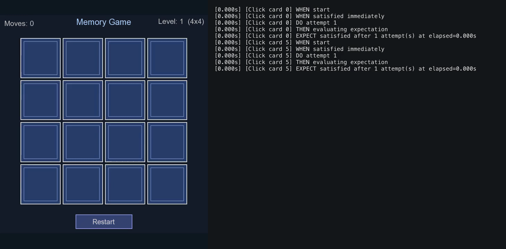

# E2E Framework

A flexible, application-agnostic end-to-end testing framework for C++ applications. This framework provides robust driver/session orchestration, interaction management, and assertion capabilities built on top of the Engine module.

## Example Test Run

The GIF below shows an end-to-end test running against a Memory Game.



## Table of Contents

1. [Overview](#overview)
2. [Architecture](#architecture)
3. [Project Structure](#project-structure)
4. [Public API](#public-api)
5. [Core Concepts](#core-concepts)
   - [Interactions](#interactions)
   - [Conditions & Expectations](#conditions--expectations)
   - [Session Management](#session-management)
6. [Usage Guide](#usage-guide)
   - [Basic Setup](#basic-setup)
   - [Writing Interactions](#writing-interactions)
   - [Using Framework Conditions](#using-framework-conditions)
   - [Custom Drivers](#custom-drivers)
7. [Configuration](#configuration)
8. [Test Categories](#test-categories)
9. [Logging & Artifacts](#logging--artifacts)
10. [Best Practices](#best-practices)

---

## Overview

The E2E Framework is a standalone CMake project that enables comprehensive end-to-end testing of applications. It abstracts away the complexity of test orchestration, providing:

- **Driver-agnostic architecture**: Works with any driver implementation
- **Retry logic with timeouts**: Automatically retries failed interactions until conditions are met
- **Structured logging**: Detailed timestamped logs for each phase of test execution
- **Artifact collection**: Optional screenshot and failure capture capabilities
- **Generic predicates**: Built-in framework conditions for common test assertions

---

## Architecture

The framework is built on a layered architecture:

```
┌─────────────────────────────────────────┐
│         Test Layer (User Code)          │  Your E2E tests
├─────────────────────────────────────────┤
│     E2EFramework (Interaction Layer)    │  Core orchestration & patterns
├─────────────────────────────────────────┤
│  Driver & Session Management            │  Test execution control
├─────────────────────────────────────────┤
│      Engine (Dependency)                │  Core application logic
└─────────────────────────────────────────┘
```

---

## Project Structure

```
E2EFramework/
├── CMakeLists.txt              # Build configuration
├── README.md                   # This file
├── LICENSE                     # License information
├── docs/                       # Documentation
├── include/E2EFramework/       # Public API headers
│   ├── Driver.h               # Driver interface
│   ├── Interaction.h          # Interaction pattern
│   ├── Conditions.h           # Framework conditions
│   ├── PageObject.h           # Page object pattern
│   └── TestCategories.h       # Test category macros
└── src/                        # Internal implementation
    └── ...
```

---

## Public API

The E2E Framework exposes the following core headers for external use:

| Header | Purpose |
|--------|---------|
| `Driver.h` | Abstract driver interface for test execution |
| `Interaction.h` | Structured interaction pattern with retry logic |
| `Conditions.h` | Built-in framework conditions and predicates |
| `PageObject.h` | Page object model support for test organization |
| `TestCategories.h` | Test categorization macros (Smoke, Regression, etc.) |

---

## Core Concepts

### Interactions

An **Interaction** represents a single test action paired with validation logic. The framework automatically retries the action until the expectation is satisfied or timeout occurs.

```cpp
auto result = session.Run(
    E2EFramework::Interaction::Custom("click-card", [](E2EFramework::Driver& driver) {
        // App-specific action: click the card
        driver.clickCard(0);
    })
    .ThenExpect([](const E2EFramework::Driver& driver) {
        // App-specific condition: verify card is face-up
        return driver.isCardFaceUp(0);
    }, "clicked card to become face up")
);
```

**Key Features:**
- Automatic retry logic with configurable timeouts
- Structured logging of each interaction phase
- Clear failure messages for debugging

### Conditions & Expectations

Conditions are predicates (functions returning `bool`) that validate the application state. The framework provides baseline conditions for common checks:

```cpp
// Using framework-provided conditions
auto result = session.Run(
    E2EFramework::Interaction::Custom("wait-until-ready", [](E2EFramework::Driver&) {})
        .ThenExpect(E2EFramework::Conditions::DriverIsRunning(),
            "driver to be running")
);
```

### Session Management

A **Session** manages the overall test execution context, including:
- Driver lifecycle
- Interaction orchestration
- Result aggregation
- Artifact collection

---

## Usage Guide

### Basic Setup

Create a session with your app-specific driver factory:

```cpp
#include "E2EFramework/Driver.h"
#include "E2EFramework/Interaction.h"

// 1. Configure the session
E2EFramework::SessionConfig config;

// 2. Provide your app-specific driver factory
config.driverFactory = []() -> std::unique_ptr<E2EFramework::Driver> {
    return std::make_unique<YourCustomDriver>();
};

// 3. Optional: Define bootstrap logic (runs once per session)
config.bootstrap = [](E2EFramework::Driver& driver) {
    driver.initialize();
    driver.advance(0.016f);  // Simulate one frame
};

// 4. Create the session
E2EFramework::Session session(config);
```

### Writing Interactions

Interactions follow a consistent pattern: **DO something, THEN verify it worked**.

```cpp
// Simple interaction with lambda
auto result = session.Run(
    E2EFramework::Interaction::Custom("flip-card", [](E2EFramework::Driver& driver) {
        driver.clickCard(0);  // DO: click the card
    })
    .ThenExpect([](const E2EFramework::Driver& driver) {
        return driver.isCardFaceUp(0);  // THEN: verify it's face-up
    }, "card should be face up after click")
);

// Check the result
if (result.isSuccess) {
    // Action succeeded within timeout
} else {
    // Action failed - result.message contains details
    std::cerr << result.message << std::endl;
}
```

### Using Framework Conditions

The framework provides built-in conditions for common scenarios:

```cpp
// Generic driver state check
session.Run(
    E2EFramework::Interaction::Custom("wait-ready", [](E2EFramework::Driver&) {})
        .ThenExpect(E2EFramework::Conditions::DriverIsRunning(),
            "driver to be running")
);
```

See `include/E2EFramework/Conditions.h` for available conditions.

### Custom Drivers

Implement the `Driver` interface for your application:

```cpp
class YourCustomDriver : public E2EFramework::Driver {
public:
    void initialize() override {
        // Initialize your app
    }
    
    void advance(float deltaTime) override {
        // Update your app state (e.g., process one frame)
    }
    
    bool saveScreenshot(const std::string& outputPath) override {
        // Capture and save a screenshot (optional)
        return false;  // Return false if not supported
    }
    
    // Add app-specific methods
    bool isCardFaceUp(int index) { /* ... */ }
    void clickCard(int index) { /* ... */ }
};
```

---

## Configuration

Configure framework behavior via `SessionConfig`:

```cpp
E2EFramework::SessionConfig config;

// Core settings
config.driverFactory = /* ... */;              // Required: driver factory
config.bootstrap = /* ... */;                 // Optional: one-time setup

// Failure handling
config.saveFailureScreenshotArtifact = true;  // Capture screenshots on failure
config.failureArtifactsDirectory = "artifacts"; // Where to store artifacts
```

**Important Notes:**
- Screenshots are only saved if the driver overrides `saveScreenshot()`
- Failure paths are appended to `ExecutionResult.message` and stored in `ExecutionResult.failureScreenshotPath`

---

## Test Categories

Organize tests with category macros from `TestCategories.h`:

```cpp
#include "E2EFramework/TestCategories.h"

// Smoke test: quick sanity checks
E2E_TEST(BoardPage, CardFlipsOnClick, Smoke) {
    // test implementation
}

// Regression test: comprehensive validation
E2E_TEST(GameFlow, CompleteMatch, Regression) {
    // test implementation
}
```

Supported categories:
- **Smoke**: Quick sanity checks
- **Regression**: Comprehensive validation tests
- **Custom**: User-defined categories

---

## Logging & Artifacts

### Logging

Every interaction emits structured logs with timestamps for each phase:

```text
[0.016s] [Click card 0] WHEN start
[0.016s] [Click card 0] WHEN satisfied immediately
[0.016s] [Click card 0] DO attempt 1
[0.016s] [Click card 0] THEN evaluating expectation
[0.024s] [Click card 0] EXPECT satisfied after 1 attempt(s) at elapsed=0.000s
```

Phases:
- **WHEN**: Pre-condition check
- **DO**: Action execution
- **THEN**: Expectation evaluation
- **EXPECT**: Final result

### Artifacts

When enabled, screenshots are automatically captured on timeout failures:

```cpp
config.saveFailureScreenshotArtifact = true;
config.failureArtifactsDirectory = "e2e_failures";

auto result = session.Run(/* ... */);
if (!result.isSuccess && result.failureScreenshotPath.has_value()) {
    // Screenshot saved at result.failureScreenshotPath.value()
}
```

---

## Best Practices

1. **Use meaningful interaction names** - Helps with debugging and log readability
   ```cpp
   E2EFramework::Interaction::Custom("match-pair-success", /* ... */)
   ```

2. **Keep interactions focused** - One logical action, one clear expectation
   ```cpp
   // Good: single concern
   .ThenExpect([](auto& driver) { return driver.isCardFaceUp(0); }, "...")
   
   // Avoid: multiple concerns
   .ThenExpect([](auto& driver) { 
       return driver.isCardFaceUp(0) && driver.getScore() > 0; 
   }, "...")
   ```

3. **Provide clear expectation descriptions** - Aids test failure analysis
   ```cpp
   .ThenExpect([/* ... */], "matched pair should be removed from board")
   ```

4. **Use framework conditions when possible** - Reduces duplication
   ```cpp
   // Instead of custom lambda, use:
   .ThenExpect(E2EFramework::Conditions::DriverIsRunning(), "...")
   ```

5. **Verify driver initialization** - Ensure bootstrap logic completes successfully
   ```cpp
   config.bootstrap = [](E2EFramework::Driver& driver) {
       driver.initialize();
       assert(driver.isReady());
   };
   ```

6. **Handle interaction failures gracefully**
   ```cpp
   auto result = session.Run(/* ... */);
   if (!result.isSuccess) {
       // Log detailed failure info
       std::cerr << "Test failed: " << result.message << std::endl;
   }
   ```

---

## License

See [LICENSE](LICENSE) file for details.

E2E_TEST_F(BoardFixture, RestartResetsSession, Regression)
{
    // test logic
}
```

## Example Game

Example integration run output (GIF):


